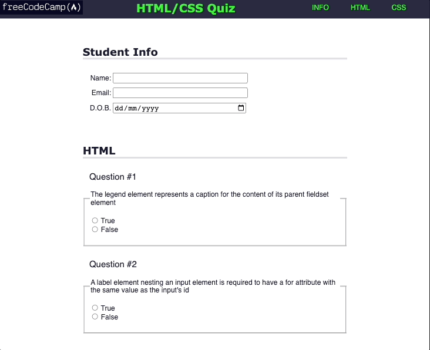

# Quiz

## Description

freeCodeCamp Challenge.

I have built a quiz to learn accessibility tools such as keyboard shortcuts, ARIA attributes, and design best practices.

Accessibility is making your webpage easy for all people to use – even people with disabilities.

## Quiz Demo

The following animation shows Quiz appearance:

# Get Started

If you click on this [link](https://cyberrie.github.io/quiz/) you will be able to enter the quiz.

If you're up for a challenge visit [freeCodeCamp](https://www.freecodecamp.org/)
